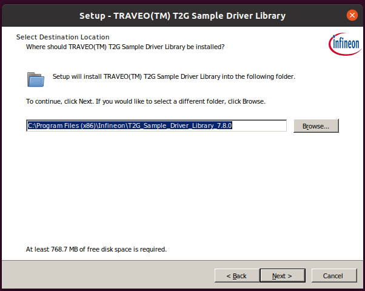
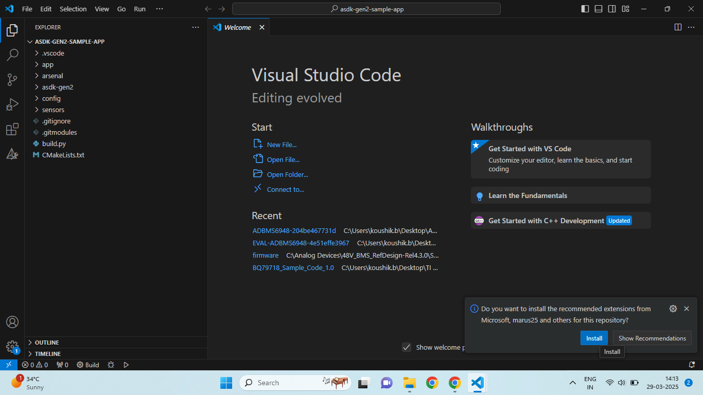
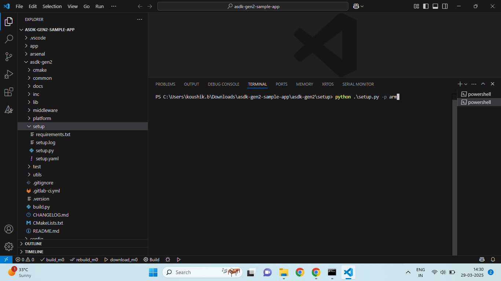
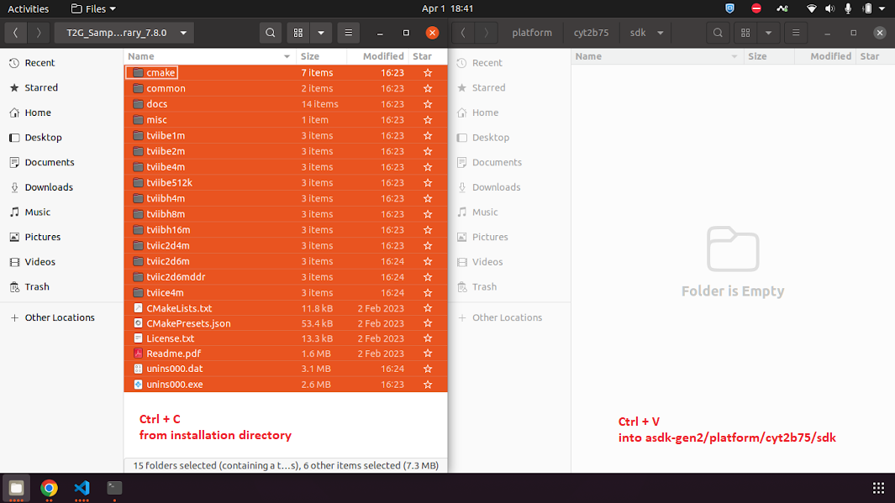
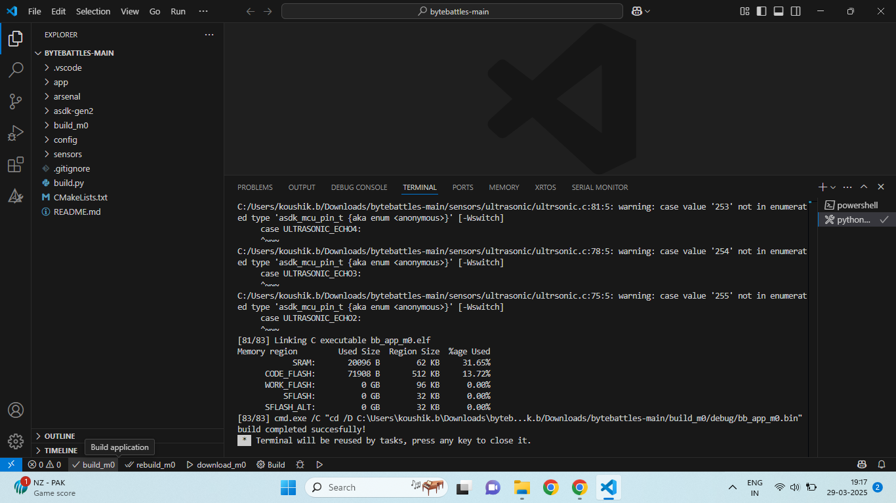
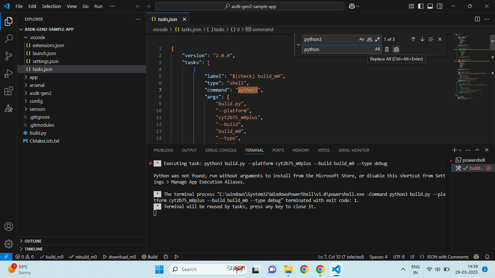

# Welcome to ByteBattles!

We're thrilled to have you join us for this exciting firmware development hackathon!

To get started, please follow the installation and setup steps outlined below. This will ensure you have all the necessary tools and environment ready for ByteBattles. Good luck, and let the coding begin!

# Software Installation Guide

This section provides step-by-step instructions and download links for installing the following software:

1.  Segger J-Link Software
2.  Segger Ozone
3.  Python 3.13
4.  7-Zip
5.  RealVNC Viewer
6.  VS Code
7.  PCAN-View and Drivers
8.  Serial Monitor

## 1. Segger J-Link Software Installation

The Segger J-Link software package provides drivers and tools for J-Link debug probes.

* **Download:** [Segger J-Link Software and Documentation Pack](https://www.segger.com/downloads/jlink/)
* **Instructions:**
    1.  Go to the download page and download the latest version for your operating system (Windows, macOS, Linux).
    2.  Run the downloaded installer.
    3.  Follow the on-screen instructions to complete the installation. Typically, you can accept the default settings.

## 2. Segger Ozone Installation

Segger Ozone is a powerful debugger that works with J-Link probes.

* **Download:** [Segger Ozone](https://www.segger.com/downloads/jlink/#Ozone)
* **Instructions:**
    1.  Go to the download page and download the latest Ozone version for your operating system.
    2.  Run the downloaded installer.
    3.  Follow the on-screen instructions to complete the installation. Again, you can usually accept the defaults.

## 3. Python 3.13 Installation

Python is a versatile programming language.

* **Download:** [Python Downloads](https://www.python.org/downloads/)
* **Instructions:**
    1.  Go to the official Python website and download the Python 3.13 installer for your operating system.
    2.  Run the downloaded installer.
    3.  **Important:** Make sure to check the "Add Python 3.13 to PATH" option during installation. This allows you to run Python from the command line.
    4.  Complete the installation.

## 4. 7-Zip Installation

7-Zip is a free and open-source file archiver.

* **Download:** [7-Zip](https://www.7-zip.org/)
* **Instructions:**
    1.  Go to the 7-Zip website and download the appropriate installer for your system (32-bit or 64-bit).
    2.  Run the downloaded installer.
    3.  Complete the installation. Default settings are usually sufficient.

## 5. RealVNC Viewer Installation

RealVNC Viewer allows you to remotely access and control other computers.

* **Download:** [RealVNC Viewer](https://www.realvnc.com/en/connect/download/viewer/)
* **Instructions:**
    1.  Go to the RealVNC website and download the VNC Viewer for your operating system.
    2.  Run the downloaded installer.
    3.  Complete the installation. Default settings are usually sufficient.

## 6. VS Code Installation

Visual Studio Code is a free and powerful code editor.

* **Download:** [Visual Studio Code](https://code.visualstudio.com/)
* **Instructions:**
    1.  Go to the VS Code website and download the installer for your operating system.
    2.  Run the downloaded installer.
    3.  Complete the installation. You can accept the default settings.

## 7. PCAN-View and Drivers Installation

PCAN-View and associated drivers are for working with PCAN interfaces.

* **Download:** [PCAN Drivers](https://www.peak-system.com/PCAN-View.242.0.html?&L=1)
* **Instructions:**
    1.  Go to the PEAK-System website and download the PCAN-Basic API and PCAN-View installation package for your operating system.
    2.  Run the downloaded installer.
    3.  Follow the on-screen instructions to complete the installation. Ensure that you install both the drivers and PCAN-View.

## 8. Serial Terminal

You can use the "Serial Monitor" extension in VS Code (https://marketplace.visualstudio.com/items?itemName=ms-vscode.vscode-serial-monitor) or choose to install a serial terminal that you are familiar with.

## 9. Git

You should download and install Git CLI tool (https://git-scm.com/downloads).

## 10. Infineon SDK

Download Version 7.8.0 of the T2G Sample Driver Library (https://itoolspriv.infineon.com/itbhs/api/packages/com.ifx.tb.tool.traveoiisampledriverlibrary/Versions/7.8.0/artifacts/sdl_installer_v7.8.0_w_ex_control_txt.zip/download) and install with default option.

**Screenshot Example:**



# ByteBattles Setup Guide

This section outlines the steps to set up the ByteBattles project from GitHub.

## 1. Cloning the repository from Github

1. Open your terminal or command prompt.
2. Navigate to the directory where you want to store the project.
3. Run the following command:
    ```bash
    git clone https://github.com/adminasdk/bytebattles.git
    ```

## 2. Installing VS Code Extensions

1.  Open VS Code.
2.  Open the "bytebattles" project on VS Code.
3.  Click the "Install" button on the pop-up shown on bottom right.  

**Screenshot Example:**


## 3. Installing Requirements and Running Setup

1.  Navigate to the `asdk-gen2/setup` directory:
    ```bash
    cd asdk-gen2/setup
    ```
2.  Install the Python requirements:
    ```bash
    pip install -r requirements.txt
    ```
3.  Run the `setup.py` script:
    ```bash
    python setup.py -p arm
    ```
4.  Close VS Code.
5.  Open VS Code and reopen the ByteBattles project folder. This ensures all installed extensions and environment changes are properly loaded.

**Screenshot Example:**


## 4. Applying patch to Infineon SDK

1. Copy contents of the SDK from the directory given during the installation of the SDK.
2. Paste it inside "asdk-gen2/platform/cyt2b75/sdk" directory.

**Screenshot Example:**


3. Open terminal and apply patch.
- For Windows, double click the "app_patch.bat" to run it or run the command
    ```batch
    app_patch.bat
    ``` 
- For Ubuntu and MacOS
    ```bash
    ./app_patch.sh
    ```

## 5. Building the Project

1.  In the VS Code status bar (the bar at the bottom), locate the "build\_m0" button.
2.  Click the "build\_m0" button to compile the project. The build process will start in the terminal.
3.  After this you should be able to find the build artifacts in the "build_m0" directory.

**Screenshot Example:**


**Note:** 
- If the `build_m0` button is not visible, ensure that the extensions are correctly installed and that the project is opened in the correct folder.
- Incase, you notice an error mentioning that "python3: command not found". Open the tasks.json file in the ".vscode" directory and replace all instances of "python3" to "python"
