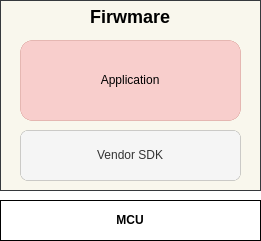

# Introduction

Ather Software Development Kit (ASDK) is an embedded software development framework for microcontrollers aimed towards 2W EVs. To quickly get started with ASDK refer the [Getting Started](./getting_started.md) page. It will help you setup ASDK and is meant to get you upto speed by blinking an LED on a microcontroller. This section will help you understand on programming microcontrollers.

The ASDK guides and its documentation does not assume any prior knowledge about `microcontrollers` or `C` programming.

> The terms "Firmware" and "Application software" are used interchangeably.

## What's invovled in programming a microcontroller?

The `C` programming language is primarily used for programming microcontrollers. In general, the source files must be cross-compiled on a host system for the target microcontroller. Hence a `C` compiler is required. On successful compilation the compiler generates the binary file which is meant to be downloaded into the target microcontroller. The process of compiling the source files to binary files is known as `build` process.

> Embedded software developers folks use the term "bare metal" programming.

Sometimes you might also want to debug the source code. So essentially the compiler, the debugger and other utilites are bundled as `Toolchain`. The most popular choice for a toolchain among all vendors is the open source version.

A microcontroller vendor, who designs the silicon, provides a Software Development Kit (SDK) for an entire family of microcontrollers in their portfolio. It contains examples, necessary boot-up files, drivers and proprietary tools. This helps to quickly evaluate thier line up of microcontrollers and also reduces the uC adoption time which eventually helps them upsell.

In general, the uC vendor supplies the following.

1. Toolchain for cross-compiling C files.
2. Software Development Kit.

The below image represents the software stack in a crude way.

## Why ASDK?

While using the vendor SDK seems to be straight forward and easier. It might not be the best approach when you have to migrate your application from one microcontroller to another. The need for ASDK is primarily born here.

Let's imagine that there's a need to change the microcontroller from vendor-1 to vendor-2 for reasons beyond your control. You will have to move your application from the current micrcocontroller to another. So you might think how hard could that be? Well, to find that out you must actually get your hands dirty to see how SDKs differ from one vendor to another and discover the challenges you progress. Below we've listed the reasons that we have seen.

* Bare-metal application prgoramming is tailored unlike programming with host operating systems.
* There's no standard interface for microcontroller drivers, instead Vendors define their own.
* Vendor specific abstraction layer to enable support for the entire family of microcontrollers.
* Switching SDK versions may break builds due to version dependencies and compatibility reasons.
* Propreitary tools such as Code generators, IDEs, CLI utilities...etc.

With above reasons it's difficult to remain agile. ASDK address above challenges and provides following benefits.

1. Portability - Ease of porting application by changing configuration files.
2. Code Resuability - Ensures uniform codebase.
3. Easy to get started with embedded systems programming.
4. Modular - Turn-off unused modules.

