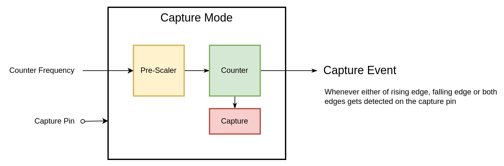

# Timer

This document serves as a guide for understanding and working with the Timer module. It elucidates all its features, demonstrates how to use timer interrupts and callbacks, and provides example and reference code snippets.

To understand the purpose of Timer let’s consider an irrigation system for a greenhouse where the plants need to be watered every 30 minutes. In this case, a Timer peripheral can be used to trigger the watering mechanism at these regular intervals. This ensures the plants in the greenhouse receive water at the right times throughout the day, maintaining optimal growth conditions. The examples section of this document covers how to achieve this task.

<div align="center">

<p>The above image represents single Timer.</p>
</div>

The functionality of a timer is to schedule events or tasks at precise intervals. It operates by setting an input counter frequency to the timer module. This frequency then undergoes a process known as prescaling (division), effectively modifying the rate at which the module processes input signals. This adjustment allows for more refined control over timing and counting operations. After these adjustments, the timer module's counter tallies each tick of the newly prescaled frequency. The counter in this module can be configured to count either up or down as per user preferences. The timer can operate in various modes, which determine how counter events are generated. These modes will be discussed in the subsequent sections.


## Timer Mode

This passage describes the standard operation of a timer i.e, in timer mode, incorporating all the fundamental components previously discussed (such as input counter frequency and pre-scaler). An additional configuration parameter, termed "period", is introduced. The "period" is a predetermined value that the counter aims to reach. When the counter attains its period (or terminal) value, it triggers a terminal count event (`ASDK_TIMER_TERMINAL_COUNT_EVENT`). This event can be utilized to initiate any user-defined action. Additionally, the user must specify the timer's behavior upon reaching the period value: it can either count up to its period value once and stop (`ASDK_TIMER_TYPE_ONESHOT`), or reset and recommence counting each time it hits the period value (`ASDK_TIMER_TYPE_PERIODIC`). Additionally, timers can be used to generate PWM signals by toggling a GPIO at every terminal count event.

<div align="center">

<p>Timer Mode</p>
</div>

Below is a code snipnet to configure a timer in timer mode. The use of the callback function will be explained in the further sections.

```c
#define USER_TIMER_CH 1

asdk_timer_t user_timer_1 = 
{
    .type = ASDK_TIMER_TYPE_PERIODIC,
    .mode = ASDK_TIMER_MODE_TIMER,
    .direction = ASDK_TIMER_COUNT_DIRECTION_UP,
    .interrupt = {
        .enable = true,
        .priority = 1
    },
    .counter_clock = {
        .frequency = 200000,                     // choosing a clock of 200KHz
        .prescaler = ASDK_CLOCK_PRESCALER_4      // 200KHz / 4 = 50 KHz
    },
    .mode_config.timer = {
        .timer_period = 5000,                   // terminal count event every 5000 ticks = 100ms
        .callback = &timer1_callback
    }
};

asdk_timer_init(USER_TIMER_CH, user_timer_1);
asdk_timer_start(USER_TIMER_CH);
```

## Compare Mode

The Compare Mode is another operational mode for the timer. This mode introduces an additional configuration parameter, the "compare" value. This is a preset value that the counter aims to match. When the counter value equals the "compare" value, a timer match event (`ASDK_TIMER_MATCH_EVENT`) is generated. This event is generated in addition to the terminal count event from the previous mode, providing an additional layer of functionality.

<div align="center">

<p>Timer Compare Mode</p>
</div>

Below is a code snipnet to configure a timer in compare mode.

```c
#define USER_TIMER_CH 1

asdk_timer_t user_timer_1 = 
{
    .type = ASDK_TIMER_TYPE_PERIODIC,
    .mode = ASDK_TIMER_MODE_COMPARE,
    .direction = ASDK_TIMER_COUNT_DIRECTION_UP,
    .interrupt = {
        .enable = true,
        .priority = 1
    },
    .counter_clock = {
        .frequency = 1000000,   // 1MHz
        .prescaler = ASDK_CLOCK_PRESCALER_1
    },
    .mode_config.compare = {
        .timer_period = 1000,   // callback every 1000 us = 1ms 
        .compare_value = 100,   // after 100 us
        .callback = &timer1_compare_callback,
    }        
};

asdk_timer_init(USER_TIMER_CH, user_timer_1);
asdk_timer_start(USER_TIMER_CH);
```


## Capture Mode

Capture mode, unlike the previous two modes, operates slightly differently. To comprehend this mode, consider the example of ultrasonic distance measurement. In this scenario, the time between sending an ultrasonic pulse and receiving its echo is measured. This duration is directly proportional to the distance. The pulse trigger of the ultrasonic sensor can be linked to a GPIO pin. The rising edge (start of pulse) and falling edge (end of pulse) can then trigger the timer to capture the counter values. The difference between these captured values represents the time taken for the pulse to travel to the object and back, which can be used to calculate the distance. Beyond this application, capture mode can also be beneficial for event time stamping and frequency measurement.

<div align="center">

<p>Timer Compare Mode</p>
</div>

In the structure of the capture mode outlined in the above diagram, an additional input linked to the timer module is noticeable. This input is a GPIO pin configured to receive input. The user has the flexibility to configure the timer to capture the counter value at the rising edge, falling edge, or both. When the state of the pin changes, the counter value is captured, triggering a capture event (`ASDK_TIMER_CAPTURE_EVENT`). Upon the generation of this event, the user can initiate any necessary actions.

Below is a code snipnet to configure a timer in capture mode. **Note:** The GPIO pin used in this configuration should already be configured as an input.

```c
#define USER_TIMER_CH 1

asdk_timer_t user_timer_1 = 
{
    .type = ASDK_TIMER_TYPE_PERIODIC,
    .mode = ASDK_TIMER_MODE_CAPTURE,
    .direction = ASDK_TIMER_COUNT_DIRECTION_UP,
    .interrupt = {
        .enable = true,
        .priority = 1
    },
    .counter_clock = {
        .frequency = 1000,                      // 1KHz
        .prescaler = ASDK_CLOCK_PRESCALER_2     // 1KHz / 2 = 500 KHz
    },
    .mode_config.capture = {
        .timer_period = 500,                    // terminal count every 500 ticks = 1s
        .mcu_pin = MCU_PIN_29,
        .edge = ASDK_TIMER_CAPTURE_ON_FALLING_EDGE,
        .callback = &timer1_capture_callback,
    }        
};

asdk_timer_init(USER_TIMER_CH, user_timer_1);
asdk_timer_start(USER_TIMER_CH);
```

## Timer Interrupt and Callbacks

Timer interrupts and callbacks are key elements in timer operations. A timer interrupt is a signal generated when a timer event occurs, such as reaching a terminal count or matching a compare value. This interrupt temporarily pauses the main program execution to handle the event in an interrupt service routine (ISR), enabling real-time responses to time-critical events.

ASDK implements the interrupt service routine and callbacks a user function within the context of the interrupt service routine. The user must define the callback function by referring `asdk_timer_callback_t` type for timer & compare modes and `asdk_capture_callback_t` type for capture mode. The assignment of these user defined callbacks is a part of the timer configuration structure `asdk_timer_t`.

Below is a code snipet for the callback function of timer in compare mode.

```c
void timer1_compare_callback(asdk_timer_event_t timer_event)
{
    if(timer_event == ASDK_TIMER_TERMINAL_COUNT_EVENT)
    {
        // user action on terminal count
    }
    else if(timer_event == ASDK_TIMER_MATCH_EVENT)
    {
        // user action on match event
    }
}
```
Below is a code snipet for the callback function of timer in capture mode.

```c
void timer1_capture_callback(asdk_timer_event_t timer_event, asdk_timer_capture_edge_t edge, uint32_t captured_value)
{
    if(timer_event == ASDK_TIMER_TERMINAL_COUNT_EVENT)
    {
        // user action on terminal count
    }
    if(timer_event == ASDK_TIMER_CAPTURE_EVENT)
    {
        // utilise the captured value and take necessary action
    }
}
```

## Examples

### Timer Mode

This example demonstrates how to utilise the timer peripheral to toggle an LED at precise intervals. By configuring the timer in periodic mode, the counter resets upon reaching its terminal count, allowing for repeated toggling of the LED.

```c
#include "asdk_platform.h"

/* ASDK app includes */
#include "asdk_system.h"
#include "asdk_clock.h"
#include "asdk_gpio.h"
#include "asdk_timer.h"

#define DELAY_250_MS 250000

#define USER_TIMER_CH 1

static asdk_gpio_config_t user_led_1 =
{
    .mcu_pin = MCU_PIN_77,
    .gpio_mode = ASDK_GPIO_MODE_OUTPUT,
    .gpio_init_state = ASDK_GPIO_STATE_HIGH,
    .gpio_pull = ASDK_GPIO_PUSH_PULL
};

void timer1_callback(asdk_timer_event_t timer_event)
{
    if(timer_event == ASDK_TIMER_TERMINAL_COUNT_EVENT)
    {
        /* code to toggle the led */
    }
}

int main()
{
    /* ... */

    /* Code to initialise GPIO */

    /* Code to initialise the timer in timer mode */

    /* Code to start the timer counter */

    for (;;)
    {
        // Simulation of some process occurring, since we have nothing else to do
        Cy_SysTick_DelayInUs(DELAY_250_MS);
    }

    return 0;
}
```

### Compare Mode

This example demonstrates the use of timer compare mode to toggle LEDs at specific intervals. We'll configure one LED to toggle at a user-defined compare count value and another at the terminal count value, leveraging the timer's interrupt callback function for event-based actions.

```c
#include "asdk_platform.h"

/* ASDK app includes */
#include "asdk_system.h"
#include "asdk_clock.h"
#include "asdk_gpio.h"
#include "asdk_timer.h"

#define DELAY_250_MS 250000

#define USER_TIMER_CH 1

void timer1_compare_callback(asdk_timer_event_t timer_event)
{
    if(timer_event == ASDK_TIMER_TERMINAL_COUNT_EVENT)
    {
        /* code to toggle the led 1 */
    }
    else if(timer_event == ASDK_TIMER_MATCH_EVENT)
    {
        /* code to toggle the led 2 */
    }
}

int main()
{
    /* ... */

    /* Code to initialise 2 GPIOs */

    /* Code to initialise the timer in compare mode */

    /* Code to start the timer counter */

    for (;;)
    {
        // Simulation of some process occurring, since we have nothing else to do
        Cy_SysTick_DelayInUs(DELAY_250_MS);
    }

    return 0;
}
```

### Capture Mode

The objective of this example is to demonstrate the use of timer capture mode for calculating the frequency of button clicks. The timer is configured with a period of 1 second. Each button click triggers a capture event, and the frequency of these events is calculated and indicated by toggling an LED.

```c
#include "asdk_platform.h"

/* ASDK app includes */
#include "asdk_system.h"
#include "asdk_clock.h"
#include "asdk_gpio.h"
#include "asdk_timer.h"

#define DELAY_1_S 1000000
#define DELAY_250_MS 250000

#define USER_TIMER_CH 1

uint32_t last_captured_value = 0;
float frequency = 0.0;  // monitor this variable to see the frequency of the signal

static asdk_gpio_config_t user_led_1 =
{
    .mcu_pin = MCU_PIN_77,
    .gpio_mode = ASDK_GPIO_MODE_OUTPUT,
    .gpio_init_state = ASDK_GPIO_STATE_HIGH,
    .gpio_pull = ASDK_GPIO_PUSH_PULL
};

static asdk_gpio_config_t user_led_4 =
{
    .mcu_pin = MCU_PIN_47,
    .gpio_mode = ASDK_GPIO_MODE_OUTPUT,
    .gpio_init_state = ASDK_GPIO_STATE_HIGH,
    .gpio_pull = ASDK_GPIO_PUSH_PULL
};

static asdk_gpio_config_t user_button_0 =
{
    .mcu_pin = MCU_PIN_29,
    .gpio_mode = ASDK_GPIO_MODE_INPUT,
    .gpio_init_state = ASDK_GPIO_STATE_HIGH,
    .gpio_pull = ASDK_GPIO_PULL_UP
};

void timer1_capture_callback(asdk_timer_event_t timer_event, asdk_timer_capture_edge_t edge, uint32_t captured_value)
{
    if(timer_event == ASDK_TIMER_TERMINAL_COUNT_EVENT)
    {
        asdk_gpio_output_toggle(user_led_1.mcu_pin);    // led 1 should toggle every 1s
    }
    if(timer_event == ASDK_TIMER_CAPTURE_EVENT)
    {
        if (captured_value < last_captured_value) 
        {
            // Handle wrap around
            frequency = 500 / ((float)(current_captured_value + (500 - last_captured_value)));
        } 
        else 
        {
            frequency = 500 / ((float)(current_captured_value - last_captured_value));
        }
        last_captured_value = captured_value;
        asdk_gpio_output_toggle(user_led_4.mcu_pin);    // led 4 should toggle everytime the button is pressed
    }
}

static asdk_timer_t user_timer_1 = 
{
    .type = ASDK_TIMER_TYPE_PERIODIC,
    .mode = ASDK_TIMER_MODE_CAPTURE,
    .direction = ASDK_TIMER_COUNT_DIRECTION_UP,
    .interrupt = {
        .enable = true,
        .priority = 1
    },
    .counter_clock = {
        .frequency = 1000,                      // 1KHz
        .prescaler = ASDK_CLOCK_PRESCALER_2     // 1KHz / 2 = 500 KHz
    },
    .mode_config.capture = {
        .timer_period = 500,                    // terminal count every 500 ticks = 1s
        .mcu_pin = MCU_PIN_29,
        .edge = ASDK_TIMER_CAPTURE_ON_FALLING_EDGE,
        .callback = &timer1_capture_callback,
    }        
};  

int main()
{
    /* ... */

    // Initialising the gpio for led toggling
    asdk_gpio_init(&user_led_1);
    asdk_gpio_init(&user_led_4);
    asdk_gpio_init(&user_button_0);

    asdk_timer_init(USER_TIMER_CH, user_timer_1);

    asdk_gpio_output_clear(user_led_1.mcu_pin);
    asdk_gpio_output_clear(user_led_4.mcu_pin);

    asdk_timer_start(USER_TIMER_CH);

    for (;;)
    {
        // Simulation of some process occurring, since we have nothing else to do
        Cy_SysTick_DelayInUs(DELAY_250_MS);
    }

    return 0;
}
```